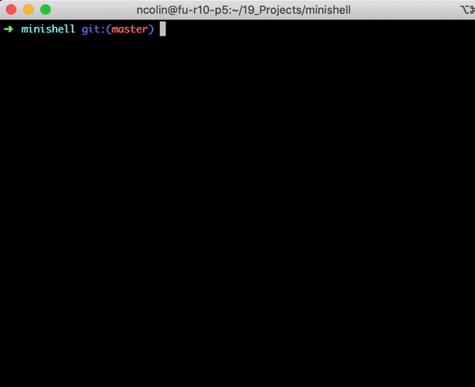

# Minishell
## Minishell project from the 42cursus @ school 19
> As beautiful as a shell
> Summary: The objective of this project is for you to create a simple shell. Yes, your
> little bash or zsh. You will learn a lot about processes and file descriptors
> in this project we have to code from scratch a shell-like program that will behave like bash.

compilation will be done by a `make` command in the terminal, you will then be able to access the program by executing the `minishell` executable file
